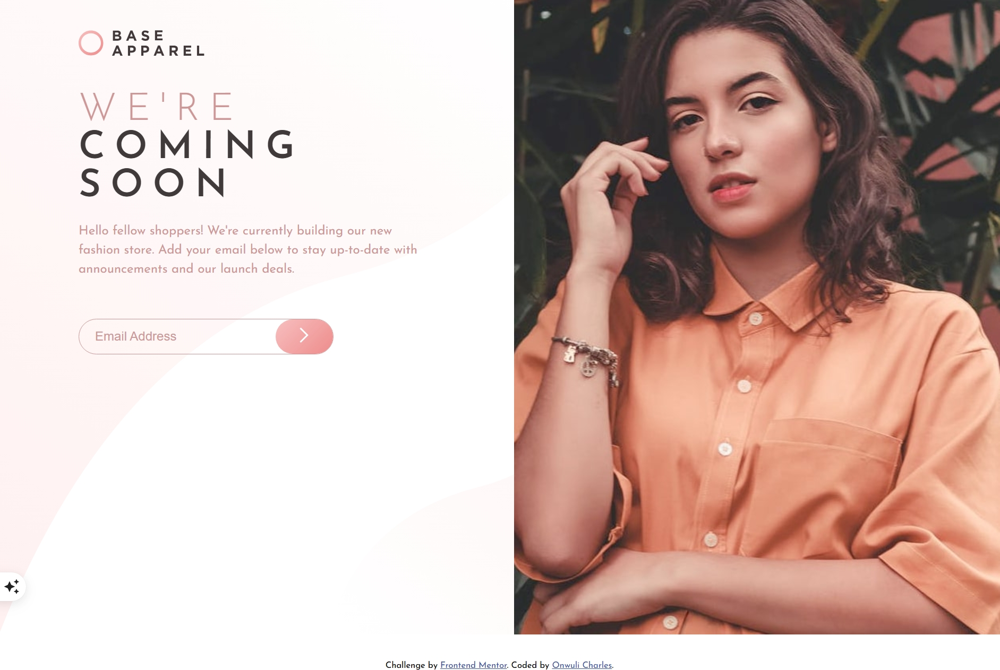

# Frontend Mentor - Base Apparel coming soon page solution

This is a solution to the [Base Apparel coming soon page challenge on Frontend Mentor](https://www.frontendmentor.io/challenges/base-apparel-coming-soon-page-5d46b47f8db8a7063f9331a0). Frontend Mentor challenges help you improve your coding skills by building realistic projects. 

## Table of contents

- [Overview](#overview)
  - [The challenge](#the-challenge)
  - [Screenshot](#screenshot)
  - [Links](#links)
- [My process](#my-process)
  - [Built with](#built-with)
  - [What I learned](#what-i-learned)
  - [Continued development](#continued-development)
  - [Useful resources](#useful-resources)
- [Author](#author)

## Overview

### The challenge

Users should be able to:

- View the optimal layout for the site depending on their device's screen size
- See hover states for all interactive elements on the page
- Receive an error message when the `form` is submitted if:
  - The `input` field is empty
  - The email address is not formatted correctly

### Screenshot

### Links

- Solution URL:(https://github.com/Ot-Charlie/base-apparel)
- Live Site URL:(https://ot-charlie.github.io/base-apparel/)

## My process

### Built with

- Semantic HTML5 markup
- CSS custom properties
- Flexbox
- CSS Grid
- Desktop-first workflow

### What I learned
This challenge was really helpful in letting me understand the workings behind form validation. From the properly structuring my HTML, to the use of Javascript functions in validating the errors

### Continued development
Hopefully I can continue improving my skills with the things I can do with Javascript.
I have noticed also that I am getting better at media queries (although there is still room for improvement )

### Useful resources

- Claude AI proved very helpful in debugging my Javascript code.

## Author

- Website - [Onwuli Charles](https://www.onwuli-charles.netlify.app)
- Frontend Mentor -(https://www.frontendmentor.io/profile/ot.charlie)
- Twitter - [@kingcharlie01](https://www.twitter.com/kingcharlie01)

